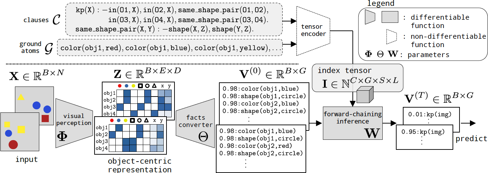
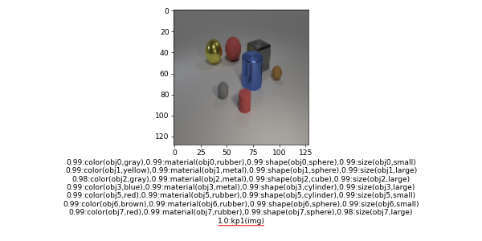
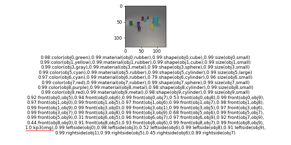

# Neuro-Symbolic Forward Reasoner (NSFR)
This is the implementation of the paper: 
### [Neuro-Symbolic Forward Reasoning](https://arxiv.org/abs/2110.09383) , preprint.
#### [Hikaru Shindo](https://www.hikarushindo.com/), [Devendra Singh Dhami](https://sites.google.com/view/devendradhami), and [Kristian Kersting](https://ml-research.github.io/people/kkersting/index.html).



## Installation
The packages are specified in [requirements.txt](./requirements.txt). Please install the packages by:
```
pip install -r requirements.txt
```

## Demo
To run the demo code on your computer (without GPUs):
### Kandinsky Patterns Twopairs Dataset:
```
python src/predict_kandinsky.py --dataset twopairs --no-cuda --batch-size 2 --plot
```

### CLEVR-Hans3 Dataset:
```
python src/predict_clevr.py --dataset clevr-hans3 --no-cuda --batch-size 2 --plot
```

The results are summarized in `result/` folder, e.g.,






NSFR performs forward reasoning in first-order logic using rules (See [data/lang](./data/lang)).
For example, the following rules are used:
#### Kandinsky Patterns Twopairs
```
kp(X):-in(O1,X),in(O2,X),in(O3,X),in(O4,X),same_shape_pair(O1,O2),same_color_pair(O1,O2),same_shape_pair(O3,O4),diff_color_pair(O3,O4).
same_shape_pair(X,Y):-shape(X,Z),shape(Y,Z).
same_color_pair(X,Y):-color(X,Z),color(Y,Z).
diff_color_pair(X,Y):-color(X,Z),color(Y,W),diff_color(Z,W).
```

#### CLEVR-Hans3
```
kp1(X):-in(O1,X),in(O2,X),size(O1,large),shape(O1,cube),size(O2,large),shape(O2,cylinder).
kp2(X):-in(O1,X),in(O2,X),size(O1,small),material(O1,metal),shape(O1,cube),size(O2,small),shape(O2,sphere).
kp3(X):-in(O1,X),in(O2,X),size(O1,large),color(O1,blue),shape(O1,sphere),size(O2,small),color(O2,yellow),shape(O2,sphere).
```


# Citation
If this repository helps your work, please consider to cite the following papers:
```
@misc{shindo2021neurosymbolic,
      title={Neuro-Symbolic Forward Reasoning}, 
      author={Hikaru Shindo and Devendra Singh Dhami and Kristian Kersting},
      year={2021},
      eprint={2110.09383},
      archivePrefix={arXiv},
      primaryClass={cs.AI}
}

@inproceedings{shindo21aaai,
  author    = {Hikaru Shindo and Masaaki Nishino and Akihiro Yamamoto},
  title     = {Differentiable Inductive Logic Programming for Structured Examples},
  booktitle = {Thirty-Fifth {AAAI} Conference on Artificial Intelligence, {AAAI}
               2021},
  pages     = {5034--5041},
  year      = {2021},
}
```


# LICENSE
See [LICENSE](./LICENSE). The [src/yolov5](./src/yolov5) folder is following [GPL3](./src/yolov5/LICENSE) license.